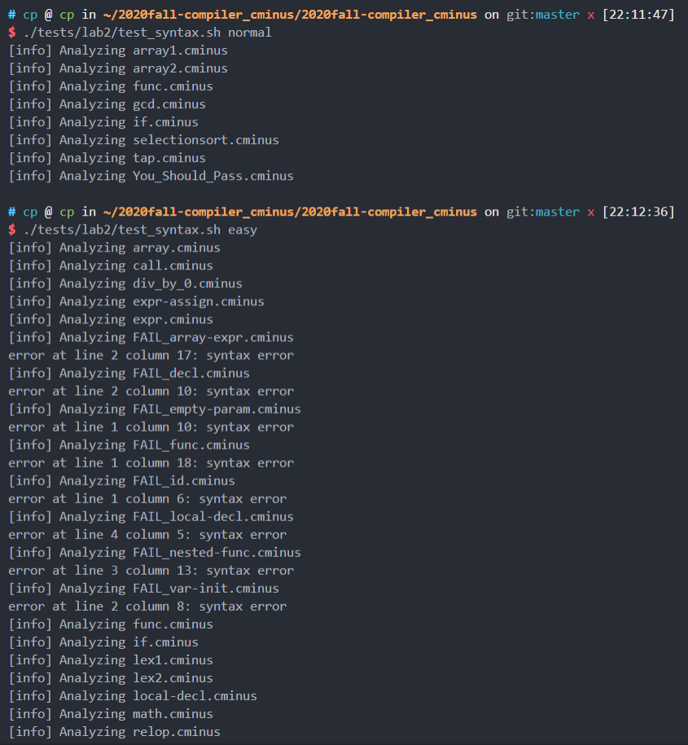
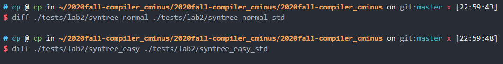
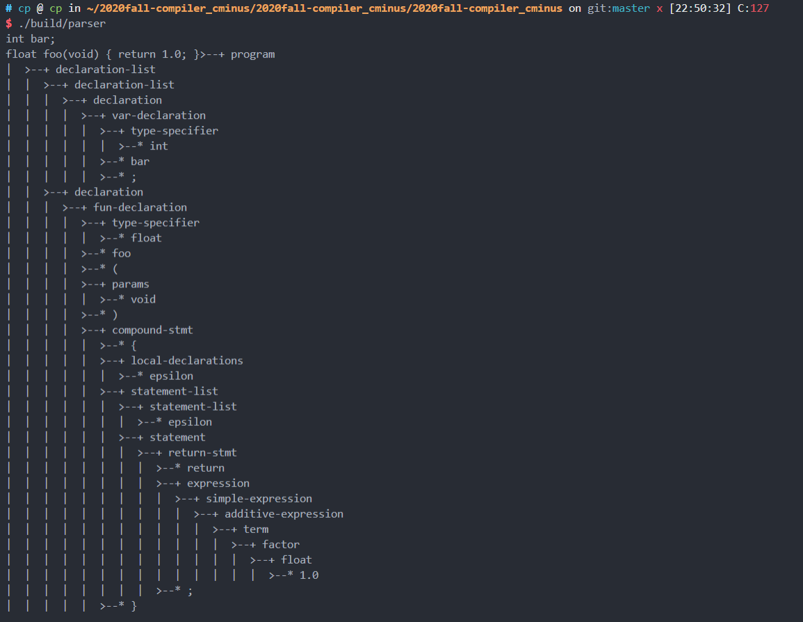

# lab2 实验报告
学号PB18071495 姓名李泓民
## 实验要求

在 Lab1 已完成的 `flex` 词法分析器的基础上，进一步使用 `bison` 完成语法分析器。

实验部分:

* 需要完善 `./src/parser/lexical_analyzer.l` 文件;
* 需要完善 `./src/parser/syntax_analyzer.y` 文件.

将自己的 lab1 的词法部分复制到 `/src/parser` 目录的 [lexical\_analyzer.l](./src/parser/lexical\_analyzer.l)并合理修改相应部分，然后根据 `cminus-f` 的语法补全 [syntax\_analyer.y](./src/parser/syntax_analyzer.y) 文件，完成语法分析器，要求最终能够输出解析树。

## 实验难点

读懂语法树的形成代码,并且合理使用node函数.

## 实验设计

先把.l文件加上助教提供的样例,再修改.y文件.

结果如下:

自己的样例

请提供部分自己的测试样例

## 实验反馈

还行,之前弄不懂就问了挺多的.