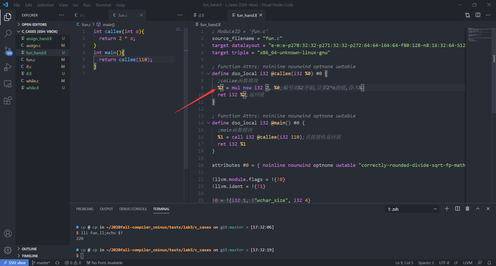
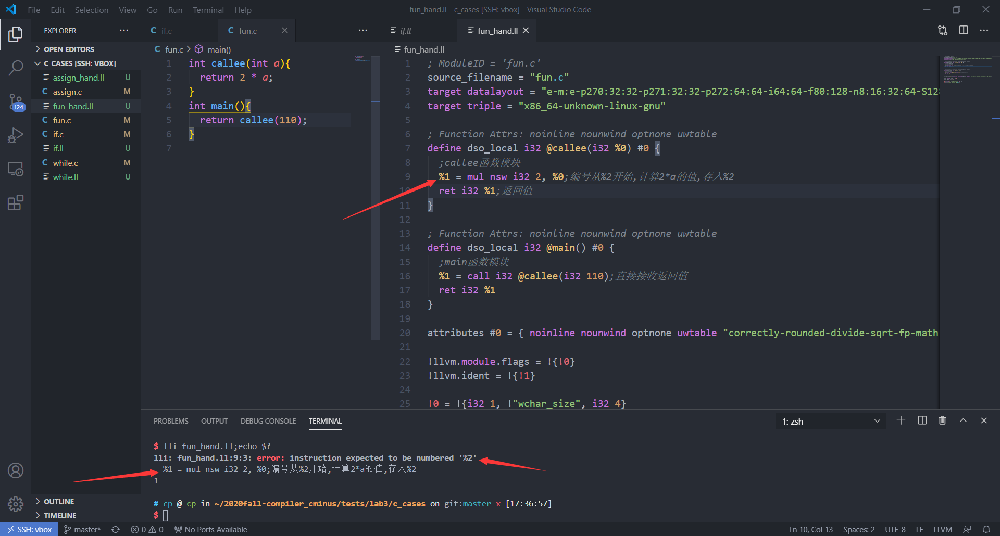
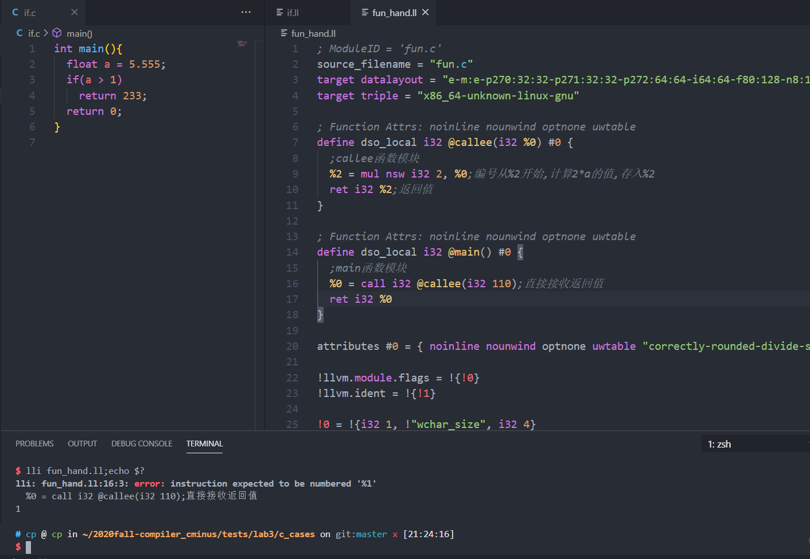

# lab3 实验报告
学号PB18071495 姓名李泓民

## 问题1: cpp与.ll的对应
请描述你的cpp代码片段和.ll的每个BasicBlock的对应关系。描述中请附上两者代码。

### assign

源文件如下:

```c
int main(){
  int a[10];
  a[0] = 10;
  a[1] = a[0] * 2;
  return a[1];
}

```

对应的语句都写到了注释里面,一般都包含了上一条注释到这一条之间的几条ll语句.因为是顺序执行没有分支跳转,所以只有一个语句块.

```c++
//进入main函数
    auto mainFun = Function::create(FunctionType::get(Int32Type, {}), "main", module);
    auto bb = BasicBlock::create(module, "entry", mainFun);
    builder->set_insert_point(bb);
```

对应于`int main()`.

```c++
//在内存中为a分配空间
    auto *arrayType = ArrayType::get(Int32Type, 10);
    auto aArray = builder->create_alloca(arrayType);
```

 对应于`int a[10];`.

```

```


### fun

源文件如下:

```c
int callee(int a){
  return 2 * a;
}
int main(){
  return callee(110);
}
```

也是大部分写到了注释里面.

```c
; Function Attrs: noinline nounwind optnone uwtable
define dso_local i32 @callee(i32 %0) #0 {
  ;callee函数模块
  %2 = mul nsw i32 2, %0;编号从%2开始,计算2*a的值,存入%2
  ret i32 %2;返回值
}
```

此块对应于

```c
int callee(int a){
  return 2 * a;
}
```

每条语句的对应关系在注释.

```c
; Function Attrs: noinline nounwind optnone uwtable
define dso_local i32 @main() #0 {
  ;main函数模块
  %1 = call i32 @callee(i32 110);直接接收返回值
  ret i32 %1;返回函数的返回值
}
```

此块对应于

```c
int main(){
  return callee(110);
}
```

每一句语句之间都有对应关系.

### if

源文件如下:

```c
int main(){
  float a = 5.555;
  if(a > 1)
    return 233;
  return 0;
}

```

每条语句的对应关系写在了注释里面.

```c
  %1 = alloca i32, align 4;预留作为返回值
  %2 = alloca float, align 4;创建变量a
  store float 0x40163851E0000000, float* %2, align 4;给a=5.555赋值
```

以上可以看做第一部分,对应于`float a = 5.555`,完成了赋值操作.

```c
  %3 = load float, float* %2, align 4
  %4 = fcmp ogt float %3, 1.000000e+00;对应a>1的比较,是float所以使用了fcmp
  br i1 %4, label %5, label %6;在这里分支
```

这里开始判断`if(a > 1)`,并有相应的跳转.

```c
5:                                                ; preds = %0赋值233
  store i32 233, i32* %1, align 4
  br label %7
```

这里为返回值%1赋值233,当`a > 1`成立的时候执行.

```c
6:                                                ; preds = %0赋值0
  store i32 0, i32* %1, align 4
  br label %7
```

这里为返回值%1赋值0,当`a > 1`不成立的时候执行.

```c
7:                                                ; preds = %6, %5最终的返回块
  %8 = load i32, i32* %1, align 4
  ret i32 %8;label5和label6分别给%1赋值233和0,只会有一个执行
```

最后的返回模块,返回233和0中的一个,根据前面的分支赋值决定.

### while

源文件如下:

```c
int main(){
  int a;
  int i;
  a = 10;
  i = 0;
  while(i < 10){
    i = i + 1;
    a = a + i;
  }
  return a;
}

```

每条语句的对应关系写在了注释里面.

```c
  %1 = alloca i32, align 4
  %2 = alloca i32, align 4
  %3 = alloca i32, align 4
  store i32 0, i32* %1, align 4
  store i32 10, i32* %2, align 4;a=10赋值操作
  store i32 0, i32* %3, align 4;i=0赋值操作
```

以上可以看做第一部分,对应于`int a;int i;a = 10;i = 0`,完成了赋值操作,顺序执行.

```c
br label %4;跳转到while条件判断

4:                                                ; preds = %7, %0循环判断i<10是否成立
  %5 = load i32, i32* %3, align 4;取i的值
  %6 = icmp slt i32 %5, 10;比较取值
  br i1 %6, label %7, label %12;满足则执行while内内容(label7)for则跳出循环
```

对应于`while(i < 10)`,因为1是循环的条件,所以要单独成为一个语句块方便后面跳转回来循环判断.

```
7:                                                ; preds = %4在i<10成立的情况下,跳转到这个label,执行本语句块
  %8 = load i32, i32* %3, align 4;取i的值
  %9 = add nsw i32 %8, 1;执行i+1
  store i32 %9, i32* %3, align 4;存回i
  %10 = load i32, i32* %2, align 4
  %11 = add nsw i32 %10, %9;执行a+i
  store i32 %11, i32* %2, align 4;存回a
  br label %4;每次执行结束跳回label4重新判断
```

对应于循环体内,`i = i + 1;a = a + i;`两句,当循环条件为真时会反复执行,所以单独成为一个语句块.

```c
12:                                               ; preds = %4跳出循环之后执行的return a
  %13 = load i32, i32* %2, align 4
  ret i32 %13
```

对应于`return a;`,当跳出循环时执行.


## 问题2: Visitor Pattern

请指出visitor.cpp中，`treeVisitor.visit(exprRoot)`执行时，以下几个Node的遍历序列:numberA、numberB、exprC、exprD、exprE、numberF、exprRoot。  
序列请按如下格式指明：  
exprRoot->numberF->exprE->numberA->exprD

## 问题3: getelementptr
请给出`IR.md`中提到的两种getelementptr用法的区别,并稍加解释:
  - `%2 = getelementptr [10 x i32], [10 x i32]* %1, i32 0, i32 %0` 
  - `%2 = getelementptr i32, i32* %1 i32 %0` 

## 实验难点
描述在实验中遇到的问题、分析和解决方案

### 其他问题

#### 关于寄存器编号的问题

注意到函数里面的寄存器分配,假如有参数%0,那么第一个变量要从%2开始.先附上问题的图片.



这样是正确的.

而如果把此处的%2改成%1就会报错.




附上参考文档的原文.

> A function definition contains a list of basic blocks, forming the CFG (Control Flow Graph) for the function. Each basic block may optionally start with a label (giving the basic block a symbol table entry), contains a list of instructions, and ends with a [terminator](http://llvm.org/docs/LangRef.html#terminators) instruction (such as a branch or function return). If an explicit label name is not provided, a block is assigned an implicit numbered label, using the next value from the same counter as used for unnamed temporaries ([see above](http://llvm.org/docs/LangRef.html#identifiers)). **For example, if a function entry block does not have an explicit label, it will be assigned label “%0”, then the first unnamed temporary in that block will be “%1”, etc.** If a numeric label is explicitly specified, it must match the numeric label that would be used implicitly.

粗体的话大概是这个意思:如果函数输入块没有显式标签，则将为其分配标签“％0”，然后该块中的第一个未命名临时名称将是“％1”，依此类推.

我的理解是%0会预留给块作为隐藏的编号,在图片的例子里面有%0参数,所以将%1作为预留的编号标签.

用main函数作为再次实验,一般第一个寄存器都是直接编号%1,假如从%0开始的话,也会报错



这也是因为%0被预留了.

同理,就和main函数里面是从%1寄存器开始用一样的,main一般是没有传入的参数,所以编号都是%1开始

假如这里用了%0开始的话就也会报错,%0被预留了

## 实验反馈
吐槽?建议?