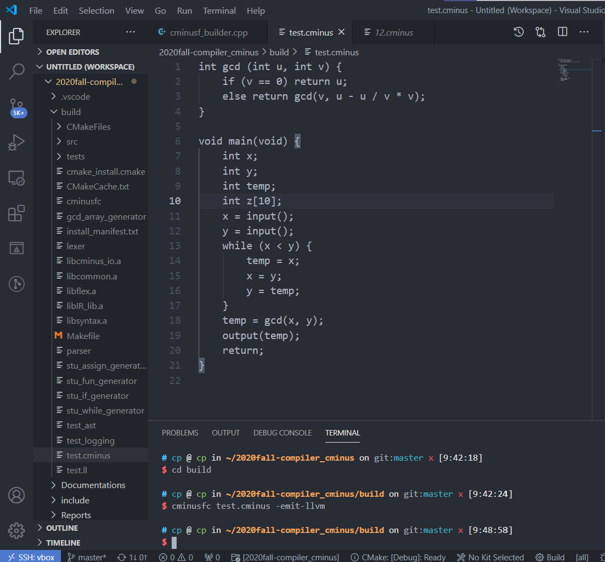
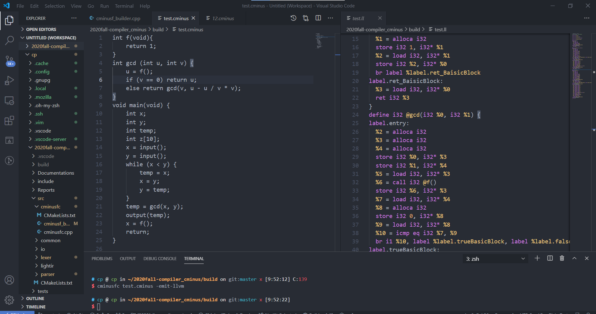
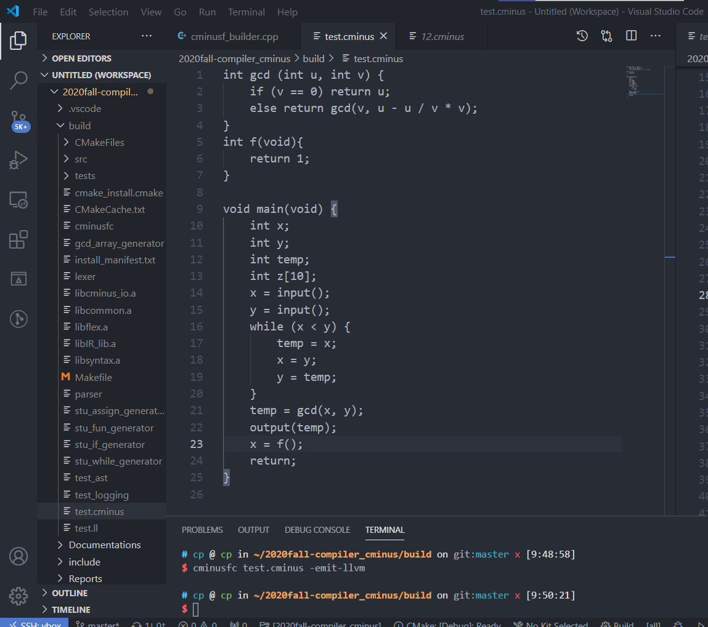
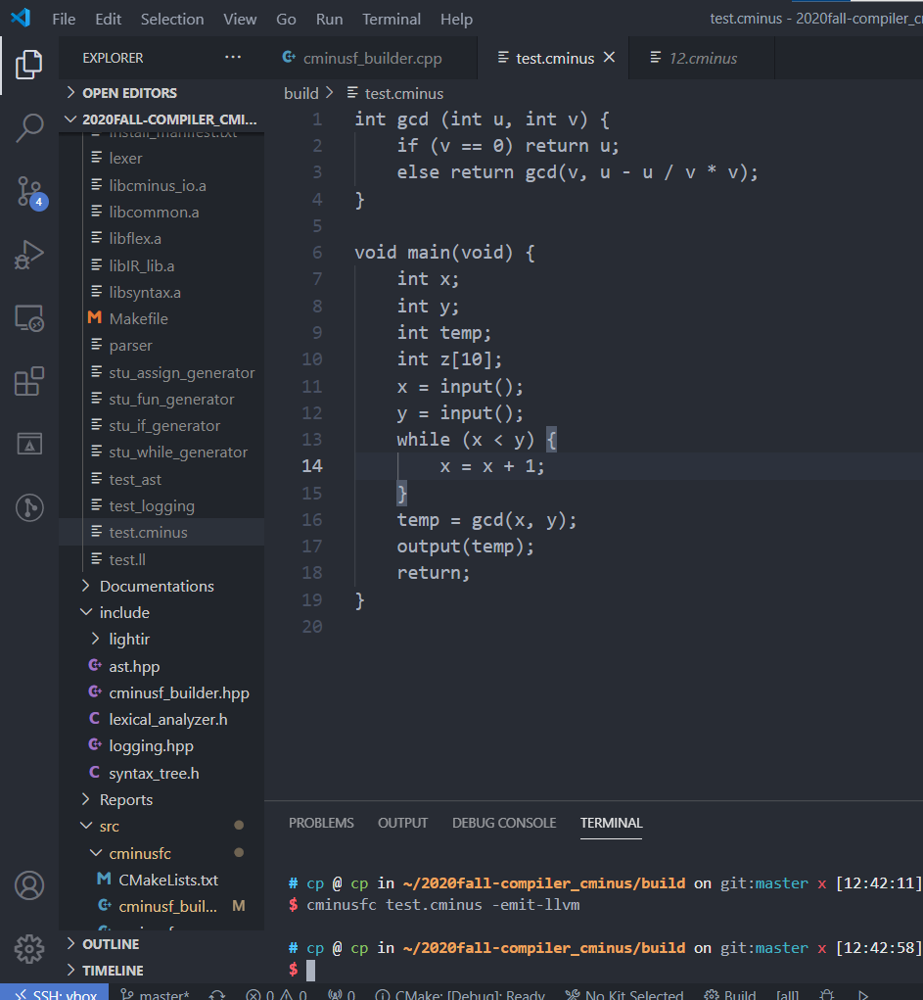
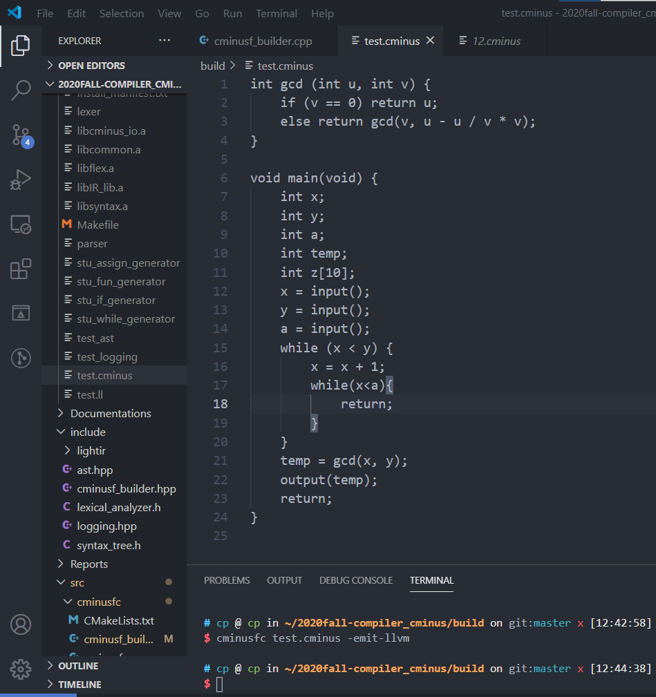

# Lab4 实验报告

小组成员  

| 姓名   | 学号       |
| ------ | ---------- |
| 李泓民 | PB18071495 |
| 单航   | PB18111747 |

## 实验要求

请按照自己的理解，写明本次实验需要干什么

1. 阅读cminus-f 的语义规则<del>成为语言律师</del>，我们将按照语义实现程度进行评分
2. 阅读LightIR 核心类介绍
3. 阅读实验框架，理解如何使用框架以及注意事项
4. 修改 `src/cminusfc/cminusf_builder.cpp` 来实现自动 IR 产生的算法，使得它能正确编译任何合法的 cminus-f 程，主要是补充cminusf_builder.cpp中的各个函数,添加自己定义的全局变量,在这个文件里面通过访问者模式实现IR自动生成的算法.

每一个函数基本上都对应了一个语句块实现,比如iteration就是while循环一样.

## 实验难点

实验中遇到哪些挑战

最开始由于看不太懂文档没有思路,根本不知道怎么下手,连一个函数都写不出来,后面才发现IRbuilder这些文件也是必须读的,很多函数就是在其他文件中早就定义好的,直接用就行了.

还有的问题就是我们对于C++也不是特别熟悉,包括shared-ptr这些,builder的各个属性,都不知道怎么调用,对于class的使用方法也不是很熟悉,去查了很久资料才开始会使用类的各个属性.

包括对于AST的各个节点是干什么的也不是很清楚,也只有仔细读了ast.cpp文件才知道accept函数的用法.

以及对于scope的作用也不是特别清楚,虽然readme里面说了是这样的:

> 在`include/cminusf_builder.hpp`中，我还定义了一个用于存储作用域的类`Scope`。它的作用是辅助我们在遍历语法树时，管理不同作用域中的变量。它提供了以下接口：
>
> ```cpp
> // 进入一个新的作用域
> void enter();
> // 退出一个作用域
> void exit();
> // 往当前作用域插入新的名字->值映射
> bool push(std::string name, Value *val);
> // 根据名字，寻找到值
> Value* find(std::string name);
> // 判断当前是否在全局作用域内
> bool in_global();
> ```
>
> 

但是实际用起来的时候根本不知道那些时候该添加scope.enter(),scope.exit()，只是知道有的地方应该判断全局变量，应该用find（）寻找变量值。

主要的难点在于有几个函数比较难写,`ASTVarDeclaration，ASTFunDeclaration，ASTSelectionStmt，ASTIterationStmt，ASTVar`这几个函数，可能是后面的是因为前面的写的有经验了所以就觉得会简单一些了...


## 实验设计

请写明为了顺利完成本次实验，加入了哪些亮点设计，并对这些设计进行解释。
可能的阐述方向有:

- 如何设计全局变量

> ```c++
> enum var_op {
>       LOAD,
>       STORE
> };
> ```
>
> var_op curr_op = LOAD;

用于分辨对于变量的操作，初始设定为LOAD。

> \#define CONST_FP(*num*) \
>
>   ConstantFP::get((float)num, module.get())

用于得到常量float的值。

> std::string valuename;

用于记录变量名。

> CminusType expression_return_type;

用于记录expression的返回值。

> Function* now_function;
>
> Function* curr_func;

分辨当前所在的函数（可能会有引用函数的情况，用于区分）。

> std::vector<CminusType> returnstack;

存储返回值的容器。

> BasicBlock* return_BasicBlock;
>
> BasicBlock* return_block;

返回的BB，指明了函数执行完之后应该跳转到哪里。

> BasicBlock* curr_block;

指明了当前处于的BasicBlock。

> Value* return_alloca;

返回值的分配储存空间。

> Value* expression;

记录在while，if和返回值里面用到的语句。

> bool is_returned = false;
>
> bool is_returned_record = false;

记录是否已经返回，返回值后就不再分析后面的代码了。

> int label_cnt = 0;

计数，记录while，if，function层数。

> bool created_ret_BasicBlock;

记录是否已经创建了返回的BB了。

> bool returned_statement;

记录是否已经是返回后的状态。

> bool use_var;

记录是否已经用过或者记录过当前变量。

- 对于accept（）函数解释：我觉得就是接受函数，递归调用的接受当前的输入。

- 比较难的函数解释
  - `ASTVarDeclaration`就是比较繁杂，分情况比较多，需要先分成全局变量和局部变量，全局变量的情况用scope.in_global（）来判断是否是全局变量，通过AST的shared_ptr，基本上记录了node的基本信息直接用就行，再分成int，float，array中的int和float集中情况分别记录，scope.push（）之前不知道用在哪，这里用来记录array的元素的。
  - `ASTFunDeclaration`算是最长的函数，先是储存参数，用一个容器来储存，便利node.params里面的各个元素，加入到容器中。其次是对于函数体的分析，先根据返回值的type（即node.type）决定function_return_type的值，接受了函数的id，存到global scope之后，再处理返回值的BasicBlock，其他的处理都交给compound_stmt。
  - `ASTSelectionStmt`之前没有学if_else的处理的时候就不太会，需要各种查资料。分配两块trueBasicBlock和falseBasicBlock，分成有else和没有else的情况来处理，有else的情况要加入一条goto语句，通过builder->set_insert_point()来实现。
  - `ASTIterationStmt`对应于while的处理，上完课之后就知道主要分成三个板块，judgeBasicBlock，trueBasicBlock和falseBasicBlock，builder->create_cond_br（）和builder->set_insert_point()函数要在judgeBasicBlock板块和trueBasicBlock都设定，以便之后跳转回来重新判断和执行，也是因为没学之前花的时间比较多吧。。。
  - `ASTVar`分两种情况，直接是id的，和是id[expression]的，对应于简单的变量和数组情况。前一种直接分integer和float处理就好了；数组的情况先分配id空间，后面看做expression处理。
  
- 自己的测试样例

  - 数组定义

  - 函数嵌套调用

  - 助教样例

  - 函数参数为void

  - while

  - while嵌套

    


### 实验总结

此次实验有什么收获

学会了cminusf的基本语法,熟悉了c++的使用

### 实验反馈 （可选 不会评分）

对本次实验的建议

希望可以多给一些参考文件,其实要看的引用的文件根本就不只有ast.cpp.还有common中的文件基本上都用得到,C++使用并不熟悉困扰很大,不会的就必须得去查资料.

### 组间交流 （可选）

本次实验和哪些组（记录组长学号）交流了哪一部分信息
